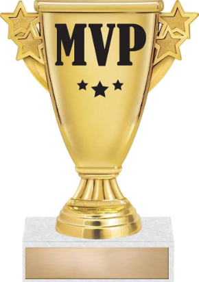

# Summer 2024

## Introduction:

### Hi!! My name is Cooper Kim. I am in the 10th grade, attending Chatsworth High School. Some of my hobbies include playing tennis, doing math problems, and hanging out with friends and family. 

## Summer Activities:

### Over the summer, I prioritized sleep and rest. However, I was still active and did many enjoyable hobbies:
- ###  Went to Omaha, Nebraska for my brother's baseball tournament
- ### Went to Montreal, Canada
- ### Spent Time with Friends and Family
- ### Watched the Olympics and Euros
- ### Played Tennis
- ### Watched my Favorite Movies and TV Shows
- ### Went to the Beach

## Favorite Summer Foods:

- ### Chicken Noodle Soup from Montreal
- ### Pork Rigatoni
- ### Bread
- ### Maple Ice Cream
- ### French Fries

## Personal Achievments:

### This summer I won MVP and Rookie of the Year for our school's Varsity Tennis Team. I've also been working on leveraging my interest in sports and math into experiments and labs. 

## Goals for the School Year:

### My main goals for this school year is to do well in my classes and get solid AP scores. I also want to play good tennis this year. This means going for shots that I usually don't go for because I am too scared that it will miss. Overall, this school year is an opportunity to grow and have fun.

